# Design screenshots

PNG renders of every board on the design canvas, one folder per round. They were made with [`../tools/shoot.mjs`](../tools/shoot.mjs) with Reduce Motion on, so every animation shows its final state.

- **Round 6 is the chosen design.** Phone screens are 1170 × 2532 (3×, the same size as a screenshot from a 390 × 844 pt iPhone such as the 12, 13 or 14). The overview board is 2×.
- Rounds 1–5 are kept for reference at 1× (390 × 844 for phone screens).
- `_manifest.json` maps each PNG to its HTML source in [`../mocks/`](../mocks/), with its size and the web fonts that loaded.

## Round 6 · Tangerine & personality (chosen design)

[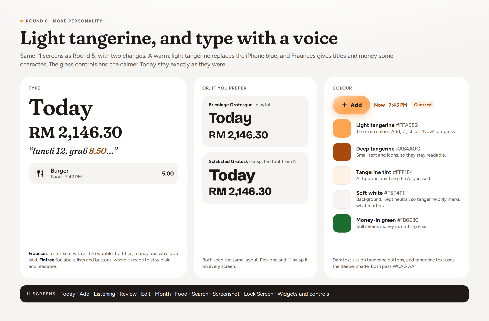](round6/00-what-changed-from-round-5.png)

<table>
<tr><td align="center" valign="top"><a href="round6/01-today.png">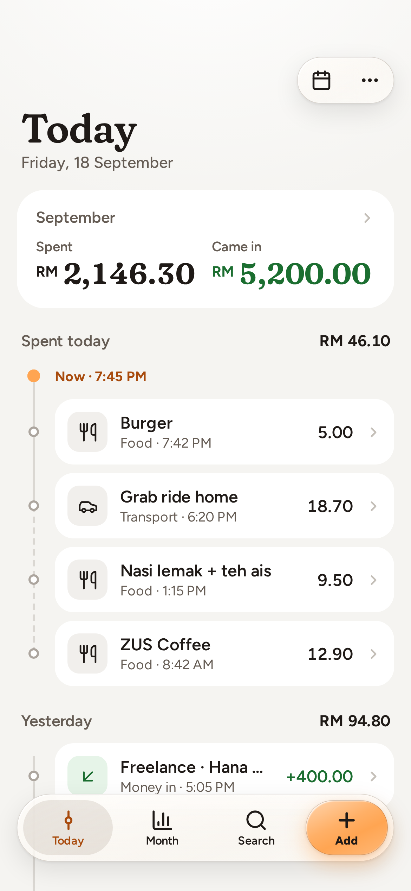</a> 1 · Today</td><td align="center" valign="top"><a href="round6/02-add.png">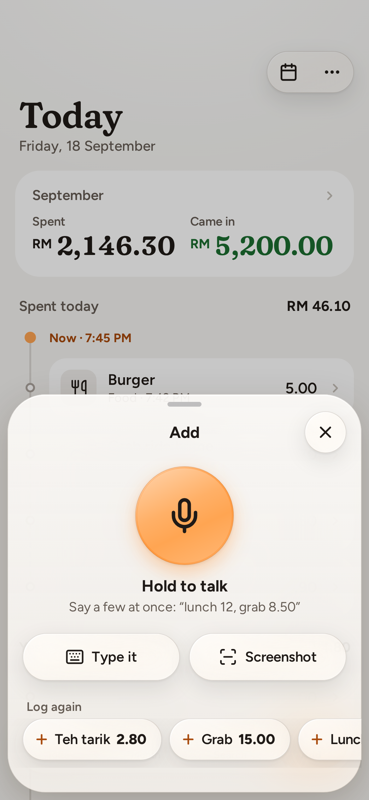</a> 2 · Add</td><td align="center" valign="top"><a href="round6/03-listening.png">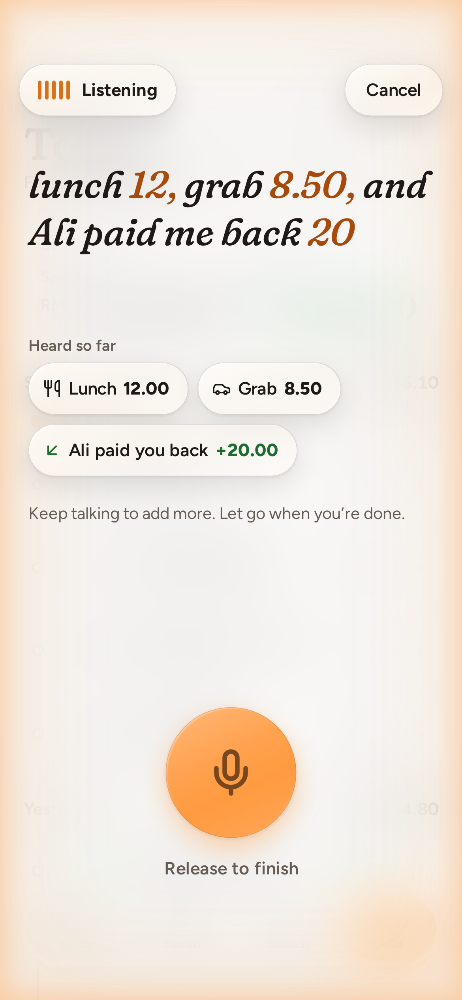</a> 3 · Listening</td></tr>
<tr><td align="center" valign="top"><a href="round6/04-review-3-entries.png">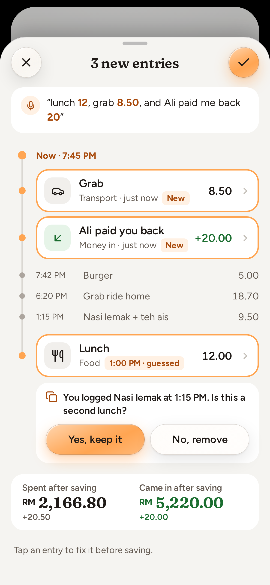</a> 4 · Review 3 entries</td><td align="center" valign="top"><a href="round6/05-edit-entry.png">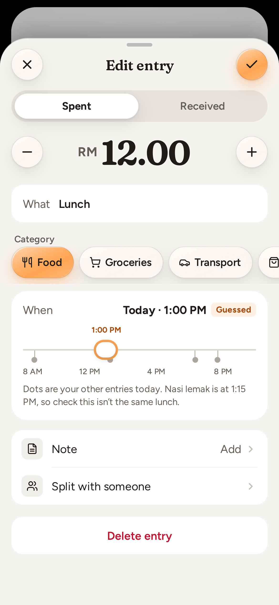</a> 5 · Edit entry</td><td align="center" valign="top"><a href="round6/06-month.png">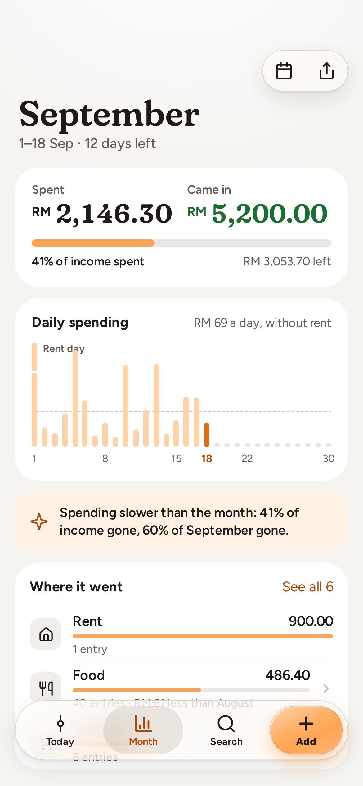</a> 6 · Month</td></tr>
<tr><td align="center" valign="top"><a href="round6/07-category-food.png">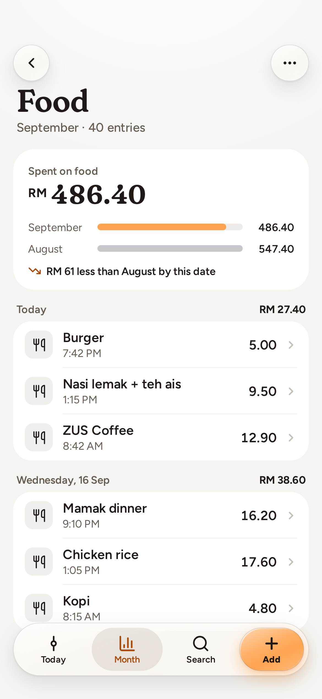</a> 7 · Category: Food</td><td align="center" valign="top"><a href="round6/08-search.png">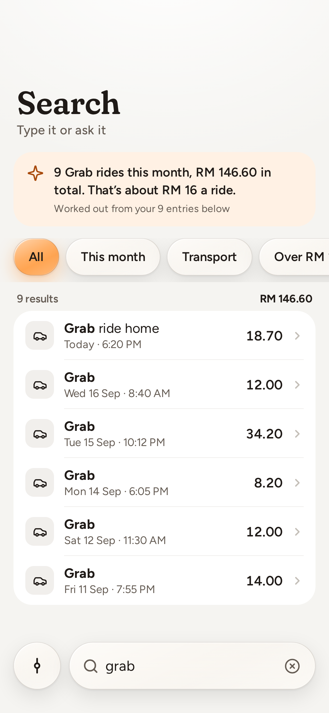</a> 8 · Search</td><td align="center" valign="top"><a href="round6/09-from-a-screenshot.png">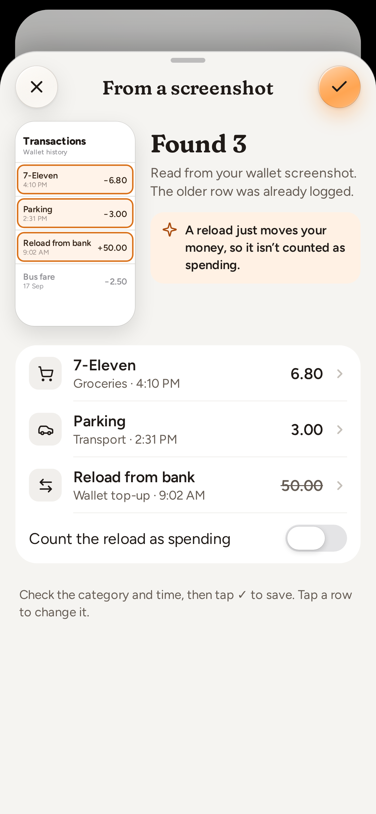</a> 9 · From a screenshot</td></tr>
<tr><td align="center" valign="top"><a href="round6/10-lock-screen.png">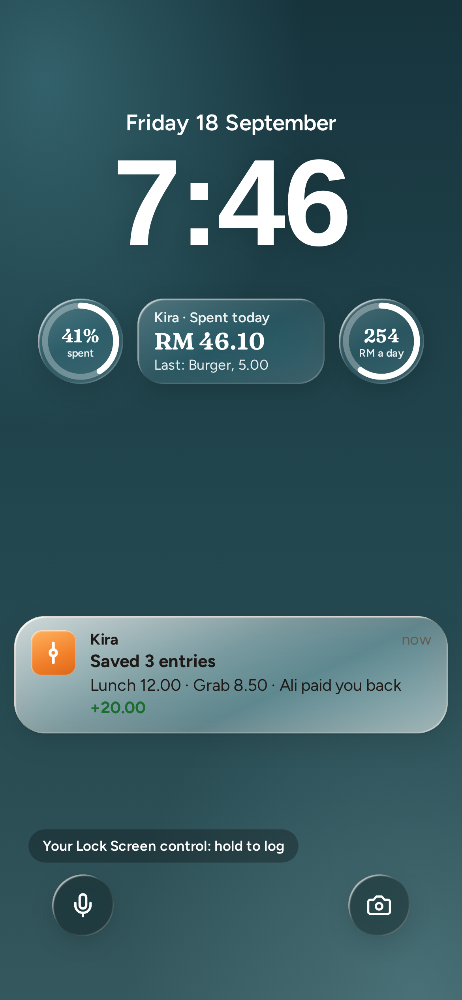</a> 10 · Lock Screen</td><td align="center" valign="top"><a href="round6/11-widgets-control-center-action-button.png">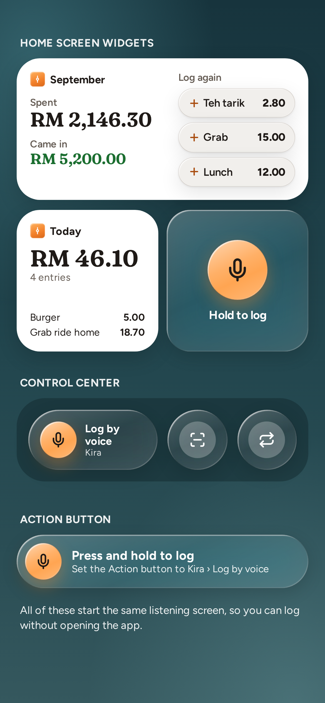</a> 11 · Widgets, Control Center, Action button</td></tr>
</table>

## Round 5 · Timeline for iOS 27

| Screen | PNG | Source |
|---|---|---|
| What changed from S | [00-what-changed-from-s.png](round5/00-what-changed-from-s.png) | [`TLNotes.dc.html`](../mocks/TLNotes.dc.html) |
| 1 · Today | [01-today.png](round5/01-today.png) | [`TLToday.dc.html`](../mocks/TLToday.dc.html) |
| 2 · Add | [02-add.png](round5/02-add.png) | [`TLAdd.dc.html`](../mocks/TLAdd.dc.html) |
| 3 · Listening | [03-listening.png](round5/03-listening.png) | [`TLListen.dc.html`](../mocks/TLListen.dc.html) |
| 4 · Review 3 entries | [04-review-3-entries.png](round5/04-review-3-entries.png) | [`TLReview.dc.html`](../mocks/TLReview.dc.html) |
| 5 · Edit entry | [05-edit-entry.png](round5/05-edit-entry.png) | [`TLEdit.dc.html`](../mocks/TLEdit.dc.html) |
| 6 · Month | [06-month.png](round5/06-month.png) | [`TLMonth.dc.html`](../mocks/TLMonth.dc.html) |
| 7 · Category: Food | [07-category-food.png](round5/07-category-food.png) | [`TLCategory.dc.html`](../mocks/TLCategory.dc.html) |
| 8 · Search | [08-search.png](round5/08-search.png) | [`TLSearch.dc.html`](../mocks/TLSearch.dc.html) |
| 9 · From a screenshot | [09-from-a-screenshot.png](round5/09-from-a-screenshot.png) | [`TLScan.dc.html`](../mocks/TLScan.dc.html) |
| 10 · Lock Screen | [10-lock-screen.png](round5/10-lock-screen.png) | [`TLLock.dc.html`](../mocks/TLLock.dc.html) |
| 11 · Widgets, Control Center, Action button | [11-widgets-control-center-action-button.png](round5/11-widgets-control-center-action-button.png) | [`TLWidgets.dc.html`](../mocks/TLWidgets.dc.html) |

## Round 4 · Clear & structured

| Screen | PNG | Source |
|---|---|---|
| How to read every screen | [00-how-to-read-every-screen.png](round4/00-how-to-read-every-screen.png) | [`Legend.dc.html`](../mocks/Legend.dc.html) |
| P1 · Stack — Home | [p1-stack-home.png](round4/p1-stack-home.png) | [`StackHome.dc.html`](../mocks/StackHome.dc.html) |
| P2 · Stack — One sentence, three entries | [p2-stack-one-sentence-three-entries.png](round4/p2-stack-one-sentence-three-entries.png) | [`StackTalk.dc.html`](../mocks/StackTalk.dc.html) |
| P3 · Stack — Edit by hand | [p3-stack-edit-by-hand.png](round4/p3-stack-edit-by-hand.png) | [`StackEdit.dc.html`](../mocks/StackEdit.dc.html) |
| Q1 · Bento — Home | [q1-bento-home.png](round4/q1-bento-home.png) | [`BentoHome.dc.html`](../mocks/BentoHome.dc.html) |
| Q2 · Bento — Three new tiles | [q2-bento-three-new-tiles.png](round4/q2-bento-three-new-tiles.png) | [`BentoTalk.dc.html`](../mocks/BentoTalk.dc.html) |
| Q3 · Bento — Edit by hand | [q3-bento-edit-by-hand.png](round4/q3-bento-edit-by-hand.png) | [`BentoEdit.dc.html`](../mocks/BentoEdit.dc.html) |
| R1 · Ledger — Statement | [r1-ledger-statement.png](round4/r1-ledger-statement.png) | [`LedgerHome.dc.html`](../mocks/LedgerHome.dc.html) |
| R2 · Ledger — Review new rows | [r2-ledger-review-new-rows.png](round4/r2-ledger-review-new-rows.png) | [`LedgerTalk.dc.html`](../mocks/LedgerTalk.dc.html) |
| R3 · Ledger — Edit a row | [r3-ledger-edit-a-row.png](round4/r3-ledger-edit-a-row.png) | [`LedgerEdit.dc.html`](../mocks/LedgerEdit.dc.html) |
| S1 · Timeline — Today | [s1-timeline-today.png](round4/s1-timeline-today.png) | [`TimelineHome.dc.html`](../mocks/TimelineHome.dc.html) |
| S2 · Timeline — Placing entries | [s2-timeline-placing-entries.png](round4/s2-timeline-placing-entries.png) | [`TimelineTalk.dc.html`](../mocks/TimelineTalk.dc.html) |
| S3 · Timeline — Edit by hand | [s3-timeline-edit-by-hand.png](round4/s3-timeline-edit-by-hand.png) | [`TimelineEdit.dc.html`](../mocks/TimelineEdit.dc.html) |
| T1 · Sheet — Home | [t1-sheet-home.png](round4/t1-sheet-home.png) | [`SheetHome.dc.html`](../mocks/SheetHome.dc.html) |
| T2 · Sheet — Listening | [t2-sheet-listening.png](round4/t2-sheet-listening.png) | [`SheetTalk.dc.html`](../mocks/SheetTalk.dc.html) |
| T3 · Sheet — Edit by hand | [t3-sheet-edit-by-hand.png](round4/t3-sheet-edit-by-hand.png) | [`SheetEdit.dc.html`](../mocks/SheetEdit.dc.html) |

## Round 3 · Type & motion

| Screen | PNG | Source |
|---|---|---|
| What the best apps do | [00-what-the-best-apps-do.png](round3/00-what-the-best-apps-do.png) | [`Research.dc.html`](../mocks/Research.dc.html) |
| K1 · Weight — Home | [k1-weight-home.png](round3/k1-weight-home.png) | [`WeightHome.dc.html`](../mocks/WeightHome.dc.html) |
| K2 · Weight — One sentence, three entries | [k2-weight-one-sentence-three-entries.png](round3/k2-weight-one-sentence-three-entries.png) | [`WeightTalk.dc.html`](../mocks/WeightTalk.dc.html) |
| K3 · Weight — Edit by hand | [k3-weight-edit-by-hand.png](round3/k3-weight-edit-by-hand.png) | [`WeightEdit.dc.html`](../mocks/WeightEdit.dc.html) |
| L1 · Lyrics — Today | [l1-lyrics-today.png](round3/l1-lyrics-today.png) | [`LyricsHome.dc.html`](../mocks/LyricsHome.dc.html) |
| L2 · Lyrics — Captions to setlist | [l2-lyrics-captions-to-setlist.png](round3/l2-lyrics-captions-to-setlist.png) | [`LyricsTalk.dc.html`](../mocks/LyricsTalk.dc.html) |
| L3 · Lyrics — Edit a line | [l3-lyrics-edit-a-line.png](round3/l3-lyrics-edit-a-line.png) | [`LyricsEdit.dc.html`](../mocks/LyricsEdit.dc.html) |
| M1 · Edition — Front page | [m1-edition-front-page.png](round3/m1-edition-front-page.png) | [`EditionHome.dc.html`](../mocks/EditionHome.dc.html) |
| M2 · Edition — Three new briefs | [m2-edition-three-new-briefs.png](round3/m2-edition-three-new-briefs.png) | [`EditionTalk.dc.html`](../mocks/EditionTalk.dc.html) |
| M3 · Edition — Corrections | [m3-edition-corrections.png](round3/m3-edition-corrections.png) | [`EditionEdit.dc.html`](../mocks/EditionEdit.dc.html) |
| N1 · Roll — Home | [n1-roll-home.png](round3/n1-roll-home.png) | [`RollHome.dc.html`](../mocks/RollHome.dc.html) |
| N2 · Roll — Chips spring out | [n2-roll-chips-spring-out.png](round3/n2-roll-chips-spring-out.png) | [`RollTalk.dc.html`](../mocks/RollTalk.dc.html) |
| N3 · Roll — Edit by hand | [n3-roll-edit-by-hand.png](round3/n3-roll-edit-by-hand.png) | [`RollEdit.dc.html`](../mocks/RollEdit.dc.html) |
| O1 · Margin — Home | [o1-margin-home.png](round3/o1-margin-home.png) | [`MarginHome.dc.html`](../mocks/MarginHome.dc.html) |
| O2 · Margin — Marked-up sentence | [o2-margin-marked-up-sentence.png](round3/o2-margin-marked-up-sentence.png) | [`MarginTalk.dc.html`](../mocks/MarginTalk.dc.html) |
| O3 · Margin — Edit by hand | [o3-margin-edit-by-hand.png](round3/o3-margin-edit-by-hand.png) | [`MarginEdit.dc.html`](../mocks/MarginEdit.dc.html) |

## Round 2 · Fun

| Screen | PNG | Source |
|---|---|---|
| F1 · Jar — Home | [f1-jar-home.png](round2/f1-jar-home.png) | [`JarHome.dc.html`](../mocks/JarHome.dc.html) |
| F2 · Jar — Three in one breath | [f2-jar-three-in-one-breath.png](round2/f2-jar-three-in-one-breath.png) | [`JarTalk.dc.html`](../mocks/JarTalk.dc.html) |
| F3 · Jar — Edit a pebble | [f3-jar-edit-a-pebble.png](round2/f3-jar-edit-a-pebble.png) | [`JarEdit.dc.html`](../mocks/JarEdit.dc.html) |
| F4 · Jar — Sorted into tubes | [f4-jar-sorted-into-tubes.png](round2/f4-jar-sorted-into-tubes.png) | [`JarSort.dc.html`](../mocks/JarSort.dc.html) |
| G1 · Mochi — Home | [g1-mochi-home.png](round2/g1-mochi-home.png) | [`MochiHome.dc.html`](../mocks/MochiHome.dc.html) |
| G2 · Mochi — It splits | [g2-mochi-it-splits.png](round2/g2-mochi-it-splits.png) | [`MochiSplit.dc.html`](../mocks/MochiSplit.dc.html) |
| G3 · Mochi — Edit | [g3-mochi-edit.png](round2/g3-mochi-edit.png) | [`MochiEdit.dc.html`](../mocks/MochiEdit.dc.html) |
| H1 · Sentence — Home | [h1-sentence-home.png](round2/h1-sentence-home.png) | [`SentenceHome.dc.html`](../mocks/SentenceHome.dc.html) |
| H2 · Sentence — Cut into three | [h2-sentence-cut-into-three.png](round2/h2-sentence-cut-into-three.png) | [`SentenceSplit.dc.html`](../mocks/SentenceSplit.dc.html) |
| H3 · Sentence — Tap a word to edit | [h3-sentence-tap-a-word-to-edit.png](round2/h3-sentence-tap-a-word-to-edit.png) | [`SentenceEdit.dc.html`](../mocks/SentenceEdit.dc.html) |
| I1 · Flap — Home | [i1-flap-home.png](round2/i1-flap-home.png) | [`FlapHome.dc.html`](../mocks/FlapHome.dc.html) |
| I2 · Flap — Now boarding | [i2-flap-now-boarding.png](round2/i2-flap-now-boarding.png) | [`FlapBoard.dc.html`](../mocks/FlapBoard.dc.html) |
| I3 · Flap — Roll the digits | [i3-flap-roll-the-digits.png](round2/i3-flap-roll-the-digits.png) | [`FlapEdit.dc.html`](../mocks/FlapEdit.dc.html) |
| J1 · Quilt — Home | [j1-quilt-home.png](round2/j1-quilt-home.png) | [`QuiltHome.dc.html`](../mocks/QuiltHome.dc.html) |
| J2 · Quilt — Weaving today | [j2-quilt-weaving-today.png](round2/j2-quilt-weaving-today.png) | [`QuiltWeave.dc.html`](../mocks/QuiltWeave.dc.html) |
| J3 · Quilt — Edit a thread | [j3-quilt-edit-a-thread.png](round2/j3-quilt-edit-a-thread.png) | [`QuiltEdit.dc.html`](../mocks/QuiltEdit.dc.html) |
| J4 · Quilt — Month poster | [j4-quilt-month-poster.png](round2/j4-quilt-month-poster.png) | [`QuiltPoster.dc.html`](../mocks/QuiltPoster.dc.html) |

## Round 1 · Calm

| Screen | PNG | Source |
|---|---|---|
| A1 · Mono — Home | [a1-mono-home.png](round1/a1-mono-home.png) | [`Main.dc.html`](../mocks/Main.dc.html) |
| A2 · Mono — Hold to talk | [a2-mono-hold-to-talk.png](round1/a2-mono-hold-to-talk.png) | [`MonoTalk.dc.html`](../mocks/MonoTalk.dc.html) |
| A3 · Mono — Where it went | [a3-mono-where-it-went.png](round1/a3-mono-where-it-went.png) | [`MonoWhere.dc.html`](../mocks/MonoWhere.dc.html) |
| B1 · Chat — Thread | [b1-chat-thread.png](round1/b1-chat-thread.png) | [`ChatThread.dc.html`](../mocks/ChatThread.dc.html) |
| B2 · Chat — Screenshot in | [b2-chat-screenshot-in.png](round1/b2-chat-screenshot-in.png) | [`ChatScreenshot.dc.html`](../mocks/ChatScreenshot.dc.html) |
| B3 · Chat — Ask anything | [b3-chat-ask-anything.png](round1/b3-chat-ask-anything.png) | [`ChatAsk.dc.html`](../mocks/ChatAsk.dc.html) |
| C1 · Orbit — Home | [c1-orbit-home.png](round1/c1-orbit-home.png) | [`OrbitHome.dc.html`](../mocks/OrbitHome.dc.html) |
| C2 · Orbit — Several at once | [c2-orbit-several-at-once.png](round1/c2-orbit-several-at-once.png) | [`OrbitListen.dc.html`](../mocks/OrbitListen.dc.html) |
| C3 · Orbit — Lock Screen | [c3-orbit-lock-screen.png](round1/c3-orbit-lock-screen.png) | [`OrbitLock.dc.html`](../mocks/OrbitLock.dc.html) |
| D1 · Inbox — Swipe to add | [d1-inbox-swipe-to-add.png](round1/d1-inbox-swipe-to-add.png) | [`InboxReview.dc.html`](../mocks/InboxReview.dc.html) |
| D2 · Inbox — Bank screenshot | [d2-inbox-bank-screenshot.png](round1/d2-inbox-bank-screenshot.png) | [`InboxScan.dc.html`](../mocks/InboxScan.dc.html) |
| D3 · Inbox — Month receipt | [d3-inbox-month-receipt.png](round1/d3-inbox-month-receipt.png) | [`InboxMonth.dc.html`](../mocks/InboxMonth.dc.html) |
| E1 · Calendar — Month | [e1-calendar-month.png](round1/e1-calendar-month.png) | [`CalendarMonth.dc.html`](../mocks/CalendarMonth.dc.html) |
| E2 · Calendar — Day & backfill | [e2-calendar-day-backfill.png](round1/e2-calendar-day-backfill.png) | [`CalendarDay.dc.html`](../mocks/CalendarDay.dc.html) |
| E3 · Calendar — Where it went | [e3-calendar-where-it-went.png](round1/e3-calendar-where-it-went.png) | [`CalendarFlow.dc.html`](../mocks/CalendarFlow.dc.html) |
| Capture anywhere | [00-capture-anywhere.png](round1/00-capture-anywhere.png) | [`CaptureAnywhere.dc.html`](../mocks/CaptureAnywhere.dc.html) |
| How the AI works | [00-how-the-ai-works.png](round1/00-how-the-ai-works.png) | [`AIPipeline.dc.html`](../mocks/AIPipeline.dc.html) |
